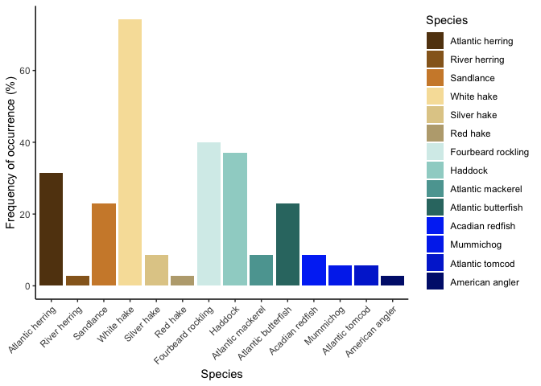
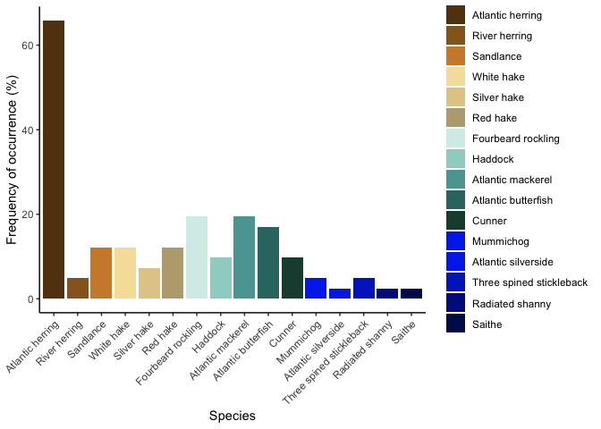
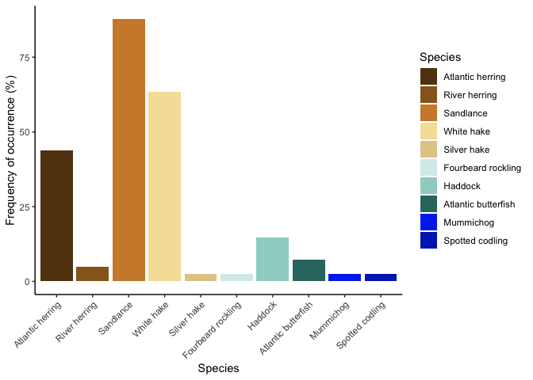
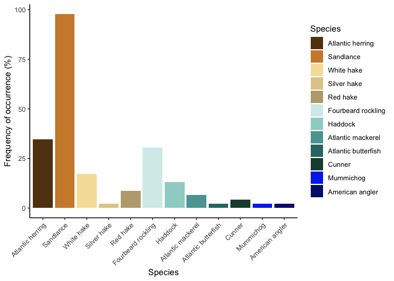
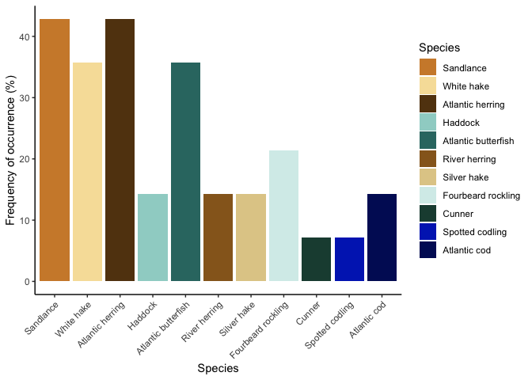

FOO\_plots\_terns
================
Gemma Clucas
9/29/2020

### Read in the rarefied feature table

Note, I made a copy of the xlsx file and saved it as a csv file. I also
deleted the full taxonomy strings, keeping only the common names of the
fish species.

Read in the csv and change the `Year` variable to a factor. Also correct
spelling
errors.

``` r
df <- read.csv("/Users/gemmaclucas/Dropbox/Diets_from_poop/2019_terns_puffins_fecal_data_analysis/MiFish/final_taxonomy_superblast/Terns/Terns_table_rarefied400_withtaxonomyedits.csv", header = TRUE) %>% 
  mutate(Year = as.factor(Year)) %>% 
  rename(River.herring = River.Herring,
         Sandlance = Sandlances,
         Mummichog = Mummichig)
```

### Create plotting order

I need to define the order of the fish along the x-axis, so that it is
consistent among graphs.

``` r
# Define x axis order
Species_ordered <-  c("Atlantic herring",
                      "River herring",
                      "Sandlance",
                      "White hake",
                      "Silver hake",
                      "Red hake",
                      "Fourbeard rockling",
                      "Haddock",
                      "Atlantic mackerel",
                      "Atlantic butterfish",
                      "Cunner",
                      "Acadian redfish",
                      "Mummichog",
                      "Atlantic silverside",
                      "Atlantic tomcod",
                      "Spotted codling",
                      "Three spined stickleback",
                      "Black spotted stickleback",
                      "Nine spine stickleback",
                      "Radiated shanny",
                      "American angler",
                      "Atlantic cod",
                      "Saithe",
                      "Tautog",
                      "Darter sp",
                      "Red lionfish")

Species_with_colours <- c("Atlantic herring" = rgb(98, 64, 18, max = 255),
                      "River herring" = rgb(150, 102, 34, max = 255),
                      "Sandlance" = rgb(207, 138, 54, max = 255),
                      "White hake" = rgb(247, 224, 167, max = 255),
                      "Silver hake" = rgb(225, 204, 150, max = 255),
                      "Red hake" = rgb(187, 169, 126, max = 255),
                      "Fourbeard rockling" = rgb(214,   237, 234, max = 255),
                      "Haddock" = rgb(159, 211, 204, max = 255),
                      "Atlantic mackerel" = rgb(92, 164, 160, max = 255),
                      "Atlantic butterfish" = rgb(50,   118, 113, max = 255),
                      "Cunner" = rgb(30, 75, 63, max = 255),
                      "Acadian redfish" = rgb(5, 60, 245, max = 255),
                      "Mummichog" = rgb(5, 57, 237, max = 255),
                      "Atlantic silverside" = rgb(6, 56, 234, max = 255),
                      "Atlantic tomcod" = rgb(4, 50, 211, max = 255),
                      "Spotted codling" = rgb(3, 44, 190, max = 255),
                      "Three spined stickleback" = rgb(3, 46, 199, max = 255),
                      "Black spotted stickleback" = rgb(3, 39, 175, max = 255),
                      "Nine spine stickleback" = rgb(1, 34, 157, max = 255),
                      "Radiated shanny" = rgb(2, 29, 141, max = 255),
                      "American angler" = rgb(1, 26, 122, max = 255),
                      "Atlantic cod" = rgb(2, 21, 100, max = 255),
                      "Saithe" = rgb(2, 19, 90, max = 255),
                      "Tautog" = rgb(1, 15, 80, max = 255),
                      "Darter sp" = rgb(0, 8, 60, max = 255),
                      "Red lionfish" = rgb(0, 0,0, max = 255))
```

### Functions to calculate FOO from filtered feature table and plot FOO

I am going to filter the feature table for e.g. COTE adults from 2017 by
hand, but then I just want to be able to use functions to calculate FOO
and plot, to save on the amount of code I have to write.

``` r
calc_FOO <- function(x) {
  x %>% 
  mutate_if(is.numeric, ~1 * (. > 0)) %>%     # change to detection/non-detection
  summarise_each(funs = sum) %>%              # count number of detections
  melt() %>%                                  # make into long dataframe
  rename(Occurrence = value,
         Species = variable) %>% 
  mutate(FOO = Occurrence/n_samples*100)
}


# get rid of periods in column names and order species
scrub_periods <- function(x) {
  x$Species <-  gsub("\\.", " ", x$Species)
  x$Species <- factor(x$Species, levels = Species_ordered)
}

# function to plot, with the species in the order determined by Species_with_colours
plot_FOO <- function(x) {
  x %>% 
    ggplot() +
    geom_bar(aes(x = Species, y = FOO, fill = Species), stat = "identity") +
    theme_classic() +
    theme(axis.text.x = element_text(angle = 45,  hjust=1)) +
    labs(y = "Frequency of occurrence (%)") +
    scale_fill_manual(values = Species_with_colours)
}
```

### Common Tern chicks in 2017

Select the COTE chick data using `filter`, change to presence/absence
data using the `mutate_if` term, then `melt` to calculate the frequence
of occurrence.

``` r
# Filter the data and save to object
COTE_chicks_2017 <- df %>% 
  filter(Species == "COTE" & Age == "chick" & Year == 2017) %>% 
  select(River.herring:White.hake) 

# record number of records for calculating FOO
n_samples <- nrow(COTE_chicks_2017)
FOO <- calc_FOO(COTE_chicks_2017)

FOO$Species <- scrub_periods(FOO)

FOO %>% 
  filter(FOO > 0) %>% 
  plot_FOO()
```

<!-- -->

### Common Tern chicks in 2018

``` r
# Filter the data and save to object
COTE_chicks_2018 <- df %>% 
  filter(Species == "COTE" & Age == "chick" & Year == 2018) %>% 
  select(River.herring:White.hake) 

# record number of records for calculating FOO
n_samples <- nrow(COTE_chicks_2018)
FOO <- calc_FOO(COTE_chicks_2018)

FOO$Species <- scrub_periods(FOO)

FOO %>% 
  filter(FOO > 0) %>% 
  plot_FOO()
```

<!-- -->

### Roseate Tern chicks in 2017

``` r
# Filter the data and save to object
ROST_chicks_2017 <- df %>% 
  filter(Species == "ROST" & Age == "chick" & Year == 2017) %>% 
  select(River.herring:White.hake) 

# record number of records for calculating FOO
n_samples <- nrow(ROST_chicks_2017)
FOO <- calc_FOO(ROST_chicks_2017)

FOO$Species <- scrub_periods(FOO)

FOO %>% 
  filter(FOO > 0) %>% 
  plot_FOO()
```

<!-- -->

### Roseate Tern chicks in 2018

``` r
# Filter the data and save to object
ROST_chicks_2018 <- df %>% 
  filter(Species == "ROST" & Age == "chick" & Year == 2018) %>% 
  select(River.herring:White.hake) 

# record number of records for calculating FOO
n_samples <- nrow(ROST_chicks_2018)
FOO <- calc_FOO(ROST_chicks_2018)

FOO$Species <- scrub_periods(FOO)

FOO %>% 
  filter(FOO > 0) %>% 
  plot_FOO()
```

<!-- -->

### Plotting them all together on one, multipanel figure

I think I can use faceting to do this, but I need to combine all the FOO
data together into one dataframe. First, save the FOO data for each
group.

``` r
n_samples <- nrow(COTE_chicks_2017)
FOO_COTE_chicks_2017 <- calc_FOO(COTE_chicks_2017)
FOO_COTE_chicks_2017$Year <- "2017"
FOO_COTE_chicks_2017$BirdSpecies <- "COTE"
FOO_COTE_chicks_2017$Age <- "chick"

n_samples <- nrow(COTE_chicks_2018)
FOO_COTE_chicks_2018 <- calc_FOO(COTE_chicks_2018)
FOO_COTE_chicks_2018$Year <- "2018"
FOO_COTE_chicks_2018$BirdSpecies <- "COTE"
FOO_COTE_chicks_2018$Age <- "chick"

n_samples <- nrow(ROST_chicks_2017)
FOO_ROST_chicks_2017 <- calc_FOO(ROST_chicks_2017)
FOO_ROST_chicks_2017$Year <- "2017"
FOO_ROST_chicks_2017$BirdSpecies <- "ROST"
FOO_ROST_chicks_2017$Age <- "chick"

n_samples <- nrow(ROST_chicks_2018)
FOO_ROST_chicks_2018 <- calc_FOO(ROST_chicks_2018)
FOO_ROST_chicks_2018$Year <- "2018"
FOO_ROST_chicks_2018$BirdSpecies <- "ROST"
FOO_ROST_chicks_2018$Age <- "chick"
```

Use row binding to add all the dataframes together so that I can use
faceting to plot.

``` r
All_FOO <- FOO_COTE_chicks_2017 %>% 
  bind_rows(., FOO_COTE_chicks_2018) %>% 
  bind_rows(., FOO_ROST_chicks_2017) %>% 
  bind_rows(., FOO_ROST_chicks_2018) 

All_FOO$Species <- scrub_periods(All_FOO)

kable(All_FOO)
```

| Species                   | Occurrence |       FOO | Year | BirdSpecies | Age   |
| :------------------------ | ---------: | --------: | :--- | :---------- | :---- |
| River herring             |          1 |  2.857143 | 2017 | COTE        | chick |
| Atlantic herring          |         11 | 31.428571 | 2017 | COTE        | chick |
| Tautog                    |          0 |  0.000000 | 2017 | COTE        | chick |
| Cunner                    |          0 |  0.000000 | 2017 | COTE        | chick |
| American angler           |          1 |  2.857143 | 2017 | COTE        | chick |
| Three spined stickleback  |          0 |  0.000000 | 2017 | COTE        | chick |
| Black spotted stickleback |          0 |  0.000000 | 2017 | COTE        | chick |
| Nine spine stickleback    |          0 |  0.000000 | 2017 | COTE        | chick |
| Radiated shanny           |          0 |  0.000000 | 2017 | COTE        | chick |
| Darter sp                 |          0 |  0.000000 | 2017 | COTE        | chick |
| Red lionfish              |          0 |  0.000000 | 2017 | COTE        | chick |
| Acadian redfish           |          3 |  8.571429 | 2017 | COTE        | chick |
| Sandlance                 |          8 | 22.857143 | 2017 | COTE        | chick |
| Atlantic silverside       |          0 |  0.000000 | 2017 | COTE        | chick |
| Mummichog                 |          2 |  5.714286 | 2017 | COTE        | chick |
| Atlantic mackerel         |          3 |  8.571429 | 2017 | COTE        | chick |
| Atlantic butterfish       |          8 | 22.857143 | 2017 | COTE        | chick |
| Atlantic cod              |          0 |  0.000000 | 2017 | COTE        | chick |
| Haddock                   |         13 | 37.142857 | 2017 | COTE        | chick |
| Atlantic tomcod           |          2 |  5.714286 | 2017 | COTE        | chick |
| Saithe                    |          0 |  0.000000 | 2017 | COTE        | chick |
| Fourbeard rockling        |         14 | 40.000000 | 2017 | COTE        | chick |
| Silver hake               |          3 |  8.571429 | 2017 | COTE        | chick |
| Red hake                  |          1 |  2.857143 | 2017 | COTE        | chick |
| Spotted codling           |          0 |  0.000000 | 2017 | COTE        | chick |
| White hake                |         26 | 74.285714 | 2017 | COTE        | chick |
| River herring             |          2 |  4.878049 | 2018 | COTE        | chick |
| Atlantic herring          |         27 | 65.853658 | 2018 | COTE        | chick |
| Tautog                    |          0 |  0.000000 | 2018 | COTE        | chick |
| Cunner                    |          4 |  9.756098 | 2018 | COTE        | chick |
| American angler           |          0 |  0.000000 | 2018 | COTE        | chick |
| Three spined stickleback  |          2 |  4.878049 | 2018 | COTE        | chick |
| Black spotted stickleback |          0 |  0.000000 | 2018 | COTE        | chick |
| Nine spine stickleback    |          0 |  0.000000 | 2018 | COTE        | chick |
| Radiated shanny           |          1 |  2.439024 | 2018 | COTE        | chick |
| Darter sp                 |          0 |  0.000000 | 2018 | COTE        | chick |
| Red lionfish              |          0 |  0.000000 | 2018 | COTE        | chick |
| Acadian redfish           |          0 |  0.000000 | 2018 | COTE        | chick |
| Sandlance                 |          5 | 12.195122 | 2018 | COTE        | chick |
| Atlantic silverside       |          1 |  2.439024 | 2018 | COTE        | chick |
| Mummichog                 |          2 |  4.878049 | 2018 | COTE        | chick |
| Atlantic mackerel         |          8 | 19.512195 | 2018 | COTE        | chick |
| Atlantic butterfish       |          7 | 17.073171 | 2018 | COTE        | chick |
| Atlantic cod              |          0 |  0.000000 | 2018 | COTE        | chick |
| Haddock                   |          4 |  9.756098 | 2018 | COTE        | chick |
| Atlantic tomcod           |          0 |  0.000000 | 2018 | COTE        | chick |
| Saithe                    |          1 |  2.439024 | 2018 | COTE        | chick |
| Fourbeard rockling        |          8 | 19.512195 | 2018 | COTE        | chick |
| Silver hake               |          3 |  7.317073 | 2018 | COTE        | chick |
| Red hake                  |          5 | 12.195122 | 2018 | COTE        | chick |
| Spotted codling           |          0 |  0.000000 | 2018 | COTE        | chick |
| White hake                |          5 | 12.195122 | 2018 | COTE        | chick |
| River herring             |          2 |  4.878049 | 2017 | ROST        | chick |
| Atlantic herring          |         18 | 43.902439 | 2017 | ROST        | chick |
| Tautog                    |          0 |  0.000000 | 2017 | ROST        | chick |
| Cunner                    |          0 |  0.000000 | 2017 | ROST        | chick |
| American angler           |          0 |  0.000000 | 2017 | ROST        | chick |
| Three spined stickleback  |          0 |  0.000000 | 2017 | ROST        | chick |
| Black spotted stickleback |          0 |  0.000000 | 2017 | ROST        | chick |
| Nine spine stickleback    |          0 |  0.000000 | 2017 | ROST        | chick |
| Radiated shanny           |          0 |  0.000000 | 2017 | ROST        | chick |
| Darter sp                 |          0 |  0.000000 | 2017 | ROST        | chick |
| Red lionfish              |          0 |  0.000000 | 2017 | ROST        | chick |
| Acadian redfish           |          0 |  0.000000 | 2017 | ROST        | chick |
| Sandlance                 |         36 | 87.804878 | 2017 | ROST        | chick |
| Atlantic silverside       |          0 |  0.000000 | 2017 | ROST        | chick |
| Mummichog                 |          1 |  2.439024 | 2017 | ROST        | chick |
| Atlantic mackerel         |          0 |  0.000000 | 2017 | ROST        | chick |
| Atlantic butterfish       |          3 |  7.317073 | 2017 | ROST        | chick |
| Atlantic cod              |          0 |  0.000000 | 2017 | ROST        | chick |
| Haddock                   |          6 | 14.634146 | 2017 | ROST        | chick |
| Atlantic tomcod           |          0 |  0.000000 | 2017 | ROST        | chick |
| Saithe                    |          0 |  0.000000 | 2017 | ROST        | chick |
| Fourbeard rockling        |          1 |  2.439024 | 2017 | ROST        | chick |
| Silver hake               |          1 |  2.439024 | 2017 | ROST        | chick |
| Red hake                  |          0 |  0.000000 | 2017 | ROST        | chick |
| Spotted codling           |          1 |  2.439024 | 2017 | ROST        | chick |
| White hake                |         26 | 63.414634 | 2017 | ROST        | chick |
| River herring             |          0 |  0.000000 | 2018 | ROST        | chick |
| Atlantic herring          |         16 | 34.782609 | 2018 | ROST        | chick |
| Tautog                    |          0 |  0.000000 | 2018 | ROST        | chick |
| Cunner                    |          2 |  4.347826 | 2018 | ROST        | chick |
| American angler           |          1 |  2.173913 | 2018 | ROST        | chick |
| Three spined stickleback  |          0 |  0.000000 | 2018 | ROST        | chick |
| Black spotted stickleback |          0 |  0.000000 | 2018 | ROST        | chick |
| Nine spine stickleback    |          0 |  0.000000 | 2018 | ROST        | chick |
| Radiated shanny           |          0 |  0.000000 | 2018 | ROST        | chick |
| Darter sp                 |          0 |  0.000000 | 2018 | ROST        | chick |
| Red lionfish              |          0 |  0.000000 | 2018 | ROST        | chick |
| Acadian redfish           |          0 |  0.000000 | 2018 | ROST        | chick |
| Sandlance                 |         45 | 97.826087 | 2018 | ROST        | chick |
| Atlantic silverside       |          0 |  0.000000 | 2018 | ROST        | chick |
| Mummichog                 |          1 |  2.173913 | 2018 | ROST        | chick |
| Atlantic mackerel         |          3 |  6.521739 | 2018 | ROST        | chick |
| Atlantic butterfish       |          1 |  2.173913 | 2018 | ROST        | chick |
| Atlantic cod              |          0 |  0.000000 | 2018 | ROST        | chick |
| Haddock                   |          6 | 13.043478 | 2018 | ROST        | chick |
| Atlantic tomcod           |          0 |  0.000000 | 2018 | ROST        | chick |
| Saithe                    |          0 |  0.000000 | 2018 | ROST        | chick |
| Fourbeard rockling        |         14 | 30.434783 | 2018 | ROST        | chick |
| Silver hake               |          1 |  2.173913 | 2018 | ROST        | chick |
| Red hake                  |          4 |  8.695652 | 2018 | ROST        | chick |
| Spotted codling           |          0 |  0.000000 | 2018 | ROST        | chick |
| White hake                |          8 | 17.391304 | 2018 | ROST        | chick |

I want to get rid of species that have zero FOO in all groups, so I can
do this by grouping by species and then filtering out species where FOO
= 0.

``` r
labels <- c(COTE = "Common Terns", ROST = "Roseate Terns")

p <- All_FOO %>% 
  group_by(Species) %>% 
  filter(FOO > 0) %>% 
  ggplot() +
  geom_bar(aes(x = Species, y = FOO, fill = Species), stat = "identity") +
  facet_grid(rows = vars(Year), cols = vars(BirdSpecies), labeller=labeller(BirdSpecies = labels)) +
  theme_classic() +
  theme(axis.text.x = element_text(angle = 45,  hjust=1, colour = "black", margin = margin(t = 0)),
        axis.text.y = element_text(colour = "black"),
        axis.text=element_text(size=7),
        axis.title=element_text(size=8, face = "bold"),
        axis.ticks.x = element_blank(),
        panel.border=element_rect(colour="black",size=1, fill = NA),
        panel.spacing = unit(2, "mm"),
        strip.background = element_blank(),
        strip.text = element_text(colour = "black", size=8, face = "bold"),
        axis.line = element_blank()) +
  labs(y = "Frequency of occurrence (%)") +
  scale_fill_manual(values = Species_with_colours) +
  theme(legend.position = "none")

p
```

<!-- -->

``` r
# ggsave(filename = "FOO_COTE_ROST_2017_2018_4panels.jpg",
#   plot = p,
#   dpi = 600,
#   device = "jpeg",
#   width = 7,
#   height = 4
# )
```

## Editing plot for Roseate tern meeting

I want to put the Roseates on the left, with sandlance first as the main
prey.

``` r
# Define x axis order
Species_ordered <-  c("Sandlance",
                      "White hake",
                      "Silver hake",
                      "Red hake",
                      "Atlantic herring",
                      "River herring",
                      "Fourbeard rockling",
                      "Haddock",
                      "Atlantic mackerel",
                      "Atlantic butterfish",
                      "Cunner",
                      "Acadian redfish",
                      "Mummichog",
                      "Atlantic silverside",
                      "Atlantic tomcod",
                      "Spotted codling",
                      "Three spined stickleback",
                      "Black spotted stickleback",
                      "Nine spine stickleback",
                      "Radiated shanny",
                      "American angler",
                      "Atlantic cod",
                      "Saithe",
                      "Tautog",
                      "Darter sp",
                      "Red lionfish")

Species_with_colours <- c("Sandlance" = rgb(207, 138, 54, max = 255),
                      "White hake" = rgb(247, 224, 167, max = 255),
                      "Silver hake" = rgb(225, 204, 150, max = 255),
                      "Red hake" = rgb(187, 169, 126, max = 255),
                      "Atlantic herring" = rgb(98, 64, 18, max = 255),
                      "River herring" = rgb(150, 102, 34, max = 255),
                      "Fourbeard rockling" = rgb(214,   237, 234, max = 255),
                      "Haddock" = rgb(159, 211, 204, max = 255),
                      "Atlantic mackerel" = rgb(92, 164, 160, max = 255),
                      "Atlantic butterfish" = rgb(50,   118, 113, max = 255),
                      "Cunner" = rgb(30, 75, 63, max = 255),
                      "Acadian redfish" = rgb(5, 60, 245, max = 255),
                      "Mummichog" = rgb(5, 57, 237, max = 255),
                      "Atlantic silverside" = rgb(6, 56, 234, max = 255),
                      "Atlantic tomcod" = rgb(4, 50, 211, max = 255),
                      "Spotted codling" = rgb(3, 44, 190, max = 255),
                      "Three spined stickleback" = rgb(3, 46, 199, max = 255),
                      "Black spotted stickleback" = rgb(3, 39, 175, max = 255),
                      "Nine spine stickleback" = rgb(1, 34, 157, max = 255),
                      "Radiated shanny" = rgb(2, 29, 141, max = 255),
                      "American angler" = rgb(1, 26, 122, max = 255),
                      "Atlantic cod" = rgb(2, 21, 100, max = 255),
                      "Saithe" = rgb(2, 19, 90, max = 255),
                      "Tautog" = rgb(1, 15, 80, max = 255),
                      "Darter sp" = rgb(0, 8, 60, max = 255),
                      "Red lionfish" = rgb(0, 0,0, max = 255))

# Set order of fish species
All_FOO$Species <- scrub_periods(All_FOO)

# Set factor order of ROST and COTE for plotting
All_FOO$BirdSpecies_f = factor(All_FOO$BirdSpecies, levels=c("ROST", "COTE"))


labels <- c(ROST = "Roseate Terns", COTE = "Common Terns")

p <- All_FOO %>% 
  group_by(Species) %>% 
  filter(FOO > 0) %>% 
  ggplot() +
  geom_bar(aes(x = Species, y = FOO, fill = Species), stat = "identity") +
  facet_grid(rows = vars(Year), cols = vars(BirdSpecies_f), labeller=labeller(BirdSpecies_f = labels)) +
  theme_classic() +
  theme(axis.text.x = element_text(angle = 45,  hjust=1, colour = "black", margin = margin(t = 0)),
        axis.text.y = element_text(colour = "black"),
        axis.text=element_text(size=7),
        axis.title=element_text(size=8, face = "bold"),
        axis.ticks.x = element_blank(),
        panel.border=element_rect(colour="black",size=1, fill = NA),
        panel.spacing = unit(2, "mm"),
        strip.background = element_blank(),
        strip.text = element_text(colour = "black", size=8, face = "bold"),
        axis.line = element_blank()) +
  labs(y = "Frequency of occurrence (%)") +
  scale_fill_manual(values = Species_with_colours) +
  theme(legend.position = "none")

p
```

<!-- -->

``` r
# ggsave(filename = "FOO_ROST_COTE_2017_2018_4panels.jpg",
#   plot = p,
#   dpi = 600,
#   device = "jpeg",
#   width = 7,
#   height = 4
# )
```

## Plotting Common Tern adults and chicks

I need to calculate the FOO of the adult diets. First, get the data for
2017 adults and plot:

``` r
# Filter the data and save to object
COTE_adults_2017 <- df %>% 
  filter(Species == "COTE" & Age == "adult" & Year == 2017) %>% 
  select(River.herring:White.hake) 

# record number of records for calculating FOO
n_samples <- nrow(COTE_adults_2017)
FOO <- calc_FOO(COTE_adults_2017)
```

    ## No id variables; using all as measure variables

``` r
FOO$Species <- scrub_periods(FOO)

FOO %>% 
  filter(FOO > 0) %>% 
  plot_FOO()
```

<!-- -->

Now do the same for 2018:

``` r
# Filter the data and save to object
COTE_adults_2018 <- df %>% 
  filter(Species == "COTE" & Age == "adult" & Year == 2018) %>% 
  select(River.herring:White.hake) 

# record number of records for calculating FOO
n_samples <- nrow(COTE_adults_2018)
FOO <- calc_FOO(COTE_adults_2018)
```

    ## No id variables; using all as measure variables

``` r
FOO$Species <- scrub_periods(FOO)

FOO %>% 
  filter(FOO > 0) %>% 
  plot_FOO()
```

<!-- -->

Store the FOO in objects, so that I can then combine with the chick data

``` r
n_samples <- nrow(COTE_adults_2017)
FOO_COTE_adults_2017 <- calc_FOO(COTE_adults_2017)
```

    ## No id variables; using all as measure variables

``` r
FOO_COTE_adults_2017$Year <- "2017"
FOO_COTE_adults_2017$BirdSpecies <- "COTE"
FOO_COTE_adults_2017$Age <- "adult"

n_samples <- nrow(COTE_adults_2018)
FOO_COTE_adults_2018 <- calc_FOO(COTE_adults_2018)
```

    ## No id variables; using all as measure variables

``` r
FOO_COTE_adults_2018$Year <- "2018"
FOO_COTE_adults_2018$BirdSpecies <- "COTE"
FOO_COTE_adults_2018$Age <- "adult"
```

Bind all the dataframes together so that I can use faceting to plot.

``` r
All_FOO <- FOO_COTE_chicks_2017 %>% 
  bind_rows(., FOO_COTE_chicks_2018) %>% 
  bind_rows(., FOO_COTE_adults_2017) %>% 
  bind_rows(., FOO_COTE_adults_2018) 

All_FOO$Species <- scrub_periods(All_FOO)

kable(All_FOO)
```

| Species                   | Occurrence |       FOO | Year | BirdSpecies | Age   |
| :------------------------ | ---------: | --------: | :--- | :---------- | :---- |
| River herring             |          1 |  2.857143 | 2017 | COTE        | chick |
| Atlantic herring          |         11 | 31.428571 | 2017 | COTE        | chick |
| Tautog                    |          0 |  0.000000 | 2017 | COTE        | chick |
| Cunner                    |          0 |  0.000000 | 2017 | COTE        | chick |
| American angler           |          1 |  2.857143 | 2017 | COTE        | chick |
| Three spined stickleback  |          0 |  0.000000 | 2017 | COTE        | chick |
| Black spotted stickleback |          0 |  0.000000 | 2017 | COTE        | chick |
| Nine spine stickleback    |          0 |  0.000000 | 2017 | COTE        | chick |
| Radiated shanny           |          0 |  0.000000 | 2017 | COTE        | chick |
| Darter sp                 |          0 |  0.000000 | 2017 | COTE        | chick |
| Red lionfish              |          0 |  0.000000 | 2017 | COTE        | chick |
| Acadian redfish           |          3 |  8.571429 | 2017 | COTE        | chick |
| Sandlance                 |          8 | 22.857143 | 2017 | COTE        | chick |
| Atlantic silverside       |          0 |  0.000000 | 2017 | COTE        | chick |
| Mummichog                 |          2 |  5.714286 | 2017 | COTE        | chick |
| Atlantic mackerel         |          3 |  8.571429 | 2017 | COTE        | chick |
| Atlantic butterfish       |          8 | 22.857143 | 2017 | COTE        | chick |
| Atlantic cod              |          0 |  0.000000 | 2017 | COTE        | chick |
| Haddock                   |         13 | 37.142857 | 2017 | COTE        | chick |
| Atlantic tomcod           |          2 |  5.714286 | 2017 | COTE        | chick |
| Saithe                    |          0 |  0.000000 | 2017 | COTE        | chick |
| Fourbeard rockling        |         14 | 40.000000 | 2017 | COTE        | chick |
| Silver hake               |          3 |  8.571429 | 2017 | COTE        | chick |
| Red hake                  |          1 |  2.857143 | 2017 | COTE        | chick |
| Spotted codling           |          0 |  0.000000 | 2017 | COTE        | chick |
| White hake                |         26 | 74.285714 | 2017 | COTE        | chick |
| River herring             |          2 |  4.878049 | 2018 | COTE        | chick |
| Atlantic herring          |         27 | 65.853658 | 2018 | COTE        | chick |
| Tautog                    |          0 |  0.000000 | 2018 | COTE        | chick |
| Cunner                    |          4 |  9.756098 | 2018 | COTE        | chick |
| American angler           |          0 |  0.000000 | 2018 | COTE        | chick |
| Three spined stickleback  |          2 |  4.878049 | 2018 | COTE        | chick |
| Black spotted stickleback |          0 |  0.000000 | 2018 | COTE        | chick |
| Nine spine stickleback    |          0 |  0.000000 | 2018 | COTE        | chick |
| Radiated shanny           |          1 |  2.439024 | 2018 | COTE        | chick |
| Darter sp                 |          0 |  0.000000 | 2018 | COTE        | chick |
| Red lionfish              |          0 |  0.000000 | 2018 | COTE        | chick |
| Acadian redfish           |          0 |  0.000000 | 2018 | COTE        | chick |
| Sandlance                 |          5 | 12.195122 | 2018 | COTE        | chick |
| Atlantic silverside       |          1 |  2.439024 | 2018 | COTE        | chick |
| Mummichog                 |          2 |  4.878049 | 2018 | COTE        | chick |
| Atlantic mackerel         |          8 | 19.512195 | 2018 | COTE        | chick |
| Atlantic butterfish       |          7 | 17.073171 | 2018 | COTE        | chick |
| Atlantic cod              |          0 |  0.000000 | 2018 | COTE        | chick |
| Haddock                   |          4 |  9.756098 | 2018 | COTE        | chick |
| Atlantic tomcod           |          0 |  0.000000 | 2018 | COTE        | chick |
| Saithe                    |          1 |  2.439024 | 2018 | COTE        | chick |
| Fourbeard rockling        |          8 | 19.512195 | 2018 | COTE        | chick |
| Silver hake               |          3 |  7.317073 | 2018 | COTE        | chick |
| Red hake                  |          5 | 12.195122 | 2018 | COTE        | chick |
| Spotted codling           |          0 |  0.000000 | 2018 | COTE        | chick |
| White hake                |          5 | 12.195122 | 2018 | COTE        | chick |
| River herring             |          2 | 14.285714 | 2017 | COTE        | adult |
| Atlantic herring          |          6 | 42.857143 | 2017 | COTE        | adult |
| Tautog                    |          0 |  0.000000 | 2017 | COTE        | adult |
| Cunner                    |          1 |  7.142857 | 2017 | COTE        | adult |
| American angler           |          0 |  0.000000 | 2017 | COTE        | adult |
| Three spined stickleback  |          0 |  0.000000 | 2017 | COTE        | adult |
| Black spotted stickleback |          0 |  0.000000 | 2017 | COTE        | adult |
| Nine spine stickleback    |          0 |  0.000000 | 2017 | COTE        | adult |
| Radiated shanny           |          0 |  0.000000 | 2017 | COTE        | adult |
| Darter sp                 |          0 |  0.000000 | 2017 | COTE        | adult |
| Red lionfish              |          0 |  0.000000 | 2017 | COTE        | adult |
| Acadian redfish           |          0 |  0.000000 | 2017 | COTE        | adult |
| Sandlance                 |          6 | 42.857143 | 2017 | COTE        | adult |
| Atlantic silverside       |          0 |  0.000000 | 2017 | COTE        | adult |
| Mummichog                 |          0 |  0.000000 | 2017 | COTE        | adult |
| Atlantic mackerel         |          0 |  0.000000 | 2017 | COTE        | adult |
| Atlantic butterfish       |          5 | 35.714286 | 2017 | COTE        | adult |
| Atlantic cod              |          2 | 14.285714 | 2017 | COTE        | adult |
| Haddock                   |          2 | 14.285714 | 2017 | COTE        | adult |
| Atlantic tomcod           |          0 |  0.000000 | 2017 | COTE        | adult |
| Saithe                    |          0 |  0.000000 | 2017 | COTE        | adult |
| Fourbeard rockling        |          3 | 21.428571 | 2017 | COTE        | adult |
| Silver hake               |          2 | 14.285714 | 2017 | COTE        | adult |
| Red hake                  |          0 |  0.000000 | 2017 | COTE        | adult |
| Spotted codling           |          1 |  7.142857 | 2017 | COTE        | adult |
| White hake                |          5 | 35.714286 | 2017 | COTE        | adult |
| River herring             |         12 | 21.052632 | 2018 | COTE        | adult |
| Atlantic herring          |         34 | 59.649123 | 2018 | COTE        | adult |
| Tautog                    |          1 |  1.754386 | 2018 | COTE        | adult |
| Cunner                    |          1 |  1.754386 | 2018 | COTE        | adult |
| American angler           |          1 |  1.754386 | 2018 | COTE        | adult |
| Three spined stickleback  |          2 |  3.508772 | 2018 | COTE        | adult |
| Black spotted stickleback |          1 |  1.754386 | 2018 | COTE        | adult |
| Nine spine stickleback    |          1 |  1.754386 | 2018 | COTE        | adult |
| Radiated shanny           |          0 |  0.000000 | 2018 | COTE        | adult |
| Darter sp                 |          0 |  0.000000 | 2018 | COTE        | adult |
| Red lionfish              |          0 |  0.000000 | 2018 | COTE        | adult |
| Acadian redfish           |          0 |  0.000000 | 2018 | COTE        | adult |
| Sandlance                 |         14 | 24.561404 | 2018 | COTE        | adult |
| Atlantic silverside       |          0 |  0.000000 | 2018 | COTE        | adult |
| Mummichog                 |          3 |  5.263158 | 2018 | COTE        | adult |
| Atlantic mackerel         |          2 |  3.508772 | 2018 | COTE        | adult |
| Atlantic butterfish       |          1 |  1.754386 | 2018 | COTE        | adult |
| Atlantic cod              |          0 |  0.000000 | 2018 | COTE        | adult |
| Haddock                   |         10 | 17.543860 | 2018 | COTE        | adult |
| Atlantic tomcod           |          0 |  0.000000 | 2018 | COTE        | adult |
| Saithe                    |          1 |  1.754386 | 2018 | COTE        | adult |
| Fourbeard rockling        |         11 | 19.298246 | 2018 | COTE        | adult |
| Silver hake               |         11 | 19.298246 | 2018 | COTE        | adult |
| Red hake                  |          5 |  8.771930 | 2018 | COTE        | adult |
| Spotted codling           |          1 |  1.754386 | 2018 | COTE        | adult |
| White hake                |          4 |  7.017544 | 2018 | COTE        | adult |

Get rid of species that have zero FOO in all groups and plot

``` r
# Make labels for the top row
labels <- c(adult = "Adults", chick = "Chicks")

p <- All_FOO %>% 
  group_by(Species) %>% 
  filter(FOO > 0) %>% 
  ggplot() +
  geom_bar(aes(x = Species, y = FOO, fill = Species), stat = "identity") +
  facet_grid(rows = vars(Year), cols = vars(Age), labeller=labeller(Age = labels)) +
  theme_classic() +
  theme(axis.text.x = element_text(angle = 45,  hjust=1, colour = "black", margin = margin(t = 0)),
        axis.text.y = element_text(colour = "black"),
        axis.text=element_text(size=7),
        axis.title=element_text(size=8, face = "bold"),
        axis.ticks.x = element_blank(),
        panel.border=element_rect(colour="black",size=1, fill = NA),
        panel.spacing = unit(2, "mm"),
        strip.background = element_blank(),
        strip.text = element_text(colour = "black", size=8, face = "bold"),
        axis.line = element_blank()) +
  labs(y = "Frequency of occurrence (%)") +
  ylim(0, 100) +
  scale_fill_manual(values = Species_with_colours) +
  theme(legend.position = "none")

p
```

<!-- -->

``` r
ggsave(filename = "FOO_COTE_adultsVchicks_2017_2018_4panels.jpg",
  plot = p,
  dpi = 600,
  device = "jpeg",
  width = 7,
  height = 4
)
```
