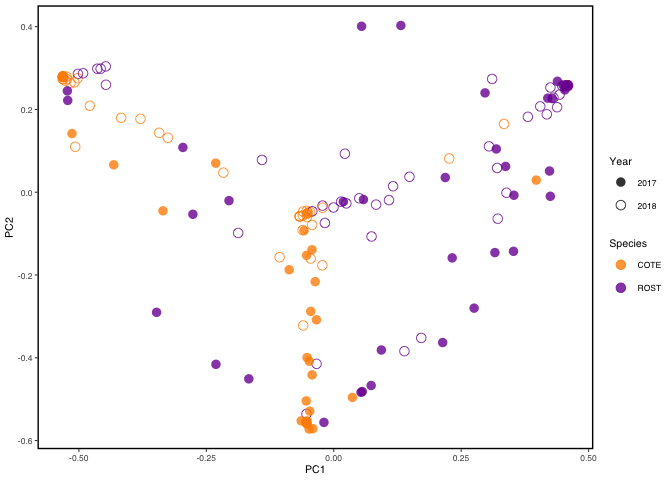
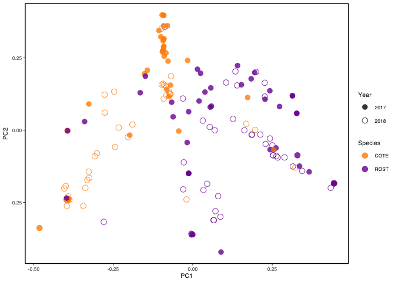
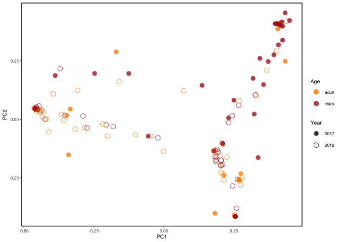
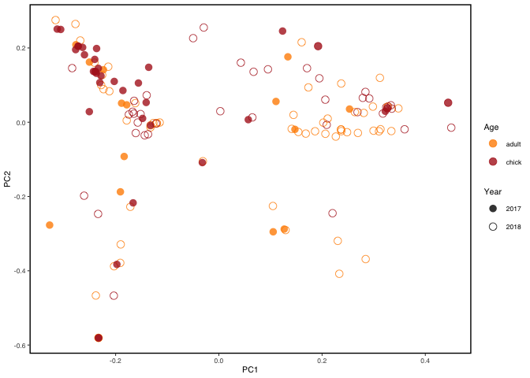

PCoA on dissimilarity matrices
================
Gemma Clucas
9/18/2020

### Read in all data

``` r
metadata <- read.table("/Users/gemmaclucas/Dropbox/Diets_from_poop/2019_terns_puffins_fecal_data_analysis/MiFish/mdat.txt",
                       sep = "\t") %>% 
  rename(SampleID = V1, 
         Species = V2, 
         Colony = V3, 
         Age = V4, 
         Year = V5, 
         SampleType = V6, 
         Plate = V7, 
         Substrate = V8)  %>% 
  mutate_if(sapply(., is.integer), as.factor) # changes Year and Plate to factors for plotting, all others are already factors


BrayCurtis_COTE_ROST <- read_qza("/Users/gemmaclucas/Dropbox/Diets_from_poop/2019_terns_puffins_fecal_data_analysis/MiFish/final_taxonomy_superblast/Terns/COTE_ROST_chicks_Bray-Curtis-PCoA_rarefied400.qza")

BrayCurtis_COTE <- read_qza("/Users/gemmaclucas/Dropbox/Diets_from_poop/2019_terns_puffins_fecal_data_analysis/MiFish/final_taxonomy_superblast/Terns/COTE_Bray-Curtis-PCoA_rarefied400.qza")

Jaccard_COTE_ROST <- read_qza("/Users/gemmaclucas/Dropbox/Diets_from_poop/2019_terns_puffins_fecal_data_analysis/MiFish/final_taxonomy_superblast/Terns/COTE_ROST_chicks_Jaccard-PCoA_rarefied400.qza")

Jaccard_COTE <- read_qza("/Users/gemmaclucas/Dropbox/Diets_from_poop/2019_terns_puffins_fecal_data_analysis/MiFish/final_taxonomy_superblast/Terns/COTE_Jaccard-PCoA_rarefied400.qza")
```

## Plot COTE vs ROST comparisons

``` r
BrayCurtis_COTE_ROST$data$Vectors %>%
  select(SampleID, PC1, PC2) %>%
  left_join(metadata) %>%
  ggplot(aes(x=PC1, y=PC2, color=`Species`, shape=`Year`)) +
  geom_point(alpha=0.8, size = 3) + 
  theme_q2r() +
  scale_shape_manual(values=c(16,1), name="Year") + 
  scale_color_manual(name="Species", values = c("#FF8F00", "#7B1FA2")) 
```

<!-- -->

``` r
# orange = #FF8F00
# purple = "#7B1FA2" 
# teal = "#00695C" 
# dark blue = "#1A237E"
# grassy green = "#7CB342"

#ggsave("BrayCurtis_COTE_ROST_PCoA.pdf", height=4, width=5, device="pdf")
```

This is a PCoA based on a Bray-Curtis dissimilarity matrix, which takes
into account the relative read abundance of each fish taxon in the diets
of **chicks** of each species. There is some differentiation between
COTE and ROST along PC1.

``` r
Jaccard_COTE_ROST$data$Vectors %>%
  select(SampleID, PC1, PC2) %>%
  left_join(metadata) %>%
  ggplot(aes(x=PC1, y=PC2, color=`Species`, shape=`Year`)) +
  geom_point(alpha=0.8, size = 3) + 
  theme_q2r() +
  scale_shape_manual(values=c(16,1), name="Year") + 
  scale_color_manual(name="Species", values = c("#FF8F00", "#7B1FA2")) 
```

<!-- -->

This is based on Jaccard distances, which do not take into account the
relative abundance of each taxon, only presence/absence data. Again,
there is some differentiation of COTE and ROST along PC1.

## Plot within COTE comparisons

``` r
BrayCurtis_COTE$data$Vectors %>%
  select(SampleID, PC1, PC2) %>%
  left_join(metadata) %>%
  ggplot(aes(x=PC1, y=PC2, color=`Age`, shape=`Year`)) +
  geom_point(alpha=0.8, size = 3) + 
  theme_q2r() +
  scale_shape_manual(values=c(16,1), name="Year") + 
  scale_color_manual(name="Age", values = c("#FF8F00", "firebrick")) 
```

<!-- -->

PCoA based on Bray-Curtis distances between COTE adults and chicks.
There isn’t really any differentiation here.

``` r
Jaccard_COTE$data$Vectors %>%
  select(SampleID, PC1, PC2) %>%
  left_join(metadata) %>%
  ggplot(aes(x=PC1, y=PC2, color=`Age`, shape=`Year`)) +
  geom_point(alpha=0.8, size = 3) + 
  theme_q2r() +
  scale_shape_manual(values=c(16,1), name="Year") + 
  scale_color_manual(name="Age", values = c("#FF8F00", "firebrick")) 
```

<!-- -->

Same thing but with Jaccard distances (presence/absence only). Agaib,
not really any differentiation between adults and chicks.
