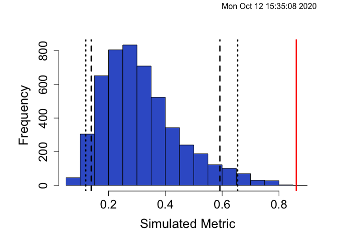

Pianka’s Niche Overlap
================
Gemma Clucas
10/6/2020

I’m following guidelines found in
[this](https://cran.r-project.org/web/packages/EcoSimR/vignettes/nicheOverlapVignette.html)
vignette. In there, they recommend the default algorithm `ra3` for
shuffling row values to test significance.

### Read in the rarefied feature table

This is the same csv that I made for the `FOO.Rmd`
script.

``` r
df <- read.csv("/Users/gemmaclucas/Dropbox/Diets_from_poop/2019_terns_puffins_fecal_data_analysis/MiFish/final_taxonomy_superblast/Terns/Terns_table_rarefied400_withtaxonomyedits.csv", header = TRUE) %>% 
  mutate(Year = as.factor(Year)) %>% 
  rename(River.herring = River.Herring,
         Sandlance = Sandlances,
         Mummichog = Mummichig)
```

### Create matrix to calculate niche overlap for COTEs

The function needs species (or in this case age groups) as rows and the
prey items in columns. It will determine the proportion for each prey
item, so it is fine to give it just the number of detections for each
prey item for now.

I have lumped the data for 2017 and 2018 together, so that the test is
just between adult and chick diets (years are not considered).

Select the data and calculate number of detections of each prey species:

``` r
COTE <- df %>% 
  dplyr::select(River.herring:White.hake, Species, Age) %>%    # keep just the columns of interest
  group_by(Species, Age) %>%                            
  mutate_if(is.numeric, ~1 * (. > 0)) %>%                           # change to detection/non-detection
  summarise_each(funs = sum) %>%                                    # sum up number of detections within in each group
  filter(Species == "COTE") %>%                                     
  mutate(group = paste(Species, Age, sep = "_")) %>%          # make new "group" name for each row
  ungroup() %>% 
  dplyr::select(group, River.herring:White.hake)

knitr::kable(COTE)  
```

| group       | River.herring | Atlantic.herring | Tautog | Cunner | American.angler | Three.spined.stickleback | Black.spotted.stickleback | Nine.spine.stickleback | Radiated.shanny | Darter.sp | Red.lionfish | Acadian.redfish | Sandlance | Atlantic.silverside | Mummichog | Atlantic.mackerel | Atlantic.butterfish | Atlantic.cod | Haddock | Atlantic.tomcod | Saithe | Fourbeard.rockling | Silver.hake | Red.hake | Spotted.codling | White.hake |
| :---------- | ------------: | ---------------: | -----: | -----: | --------------: | -----------------------: | ------------------------: | ---------------------: | --------------: | --------: | -----------: | --------------: | --------: | ------------------: | --------: | ----------------: | ------------------: | -----------: | ------: | --------------: | -----: | -----------------: | ----------: | -------: | --------------: | ---------: |
| COTE\_adult |            14 |               40 |      1 |      2 |               1 |                        2 |                         1 |                      1 |               0 |         0 |            0 |               0 |        20 |                   0 |         3 |                 2 |                   6 |            2 |      12 |               0 |      1 |                 14 |          13 |        5 |               2 |          9 |
| COTE\_chick |             3 |               38 |      0 |      4 |               1 |                        2 |                         0 |                      0 |               1 |         0 |            0 |               3 |        13 |                   1 |         4 |                11 |                  15 |            0 |      17 |               2 |      1 |                 22 |           6 |        6 |               0 |         31 |

### Calculate Pianka’s niche overlap on the COTE matrix

To calculate just the score, you can use the `pianka()` function.

``` r
COTE %>% dplyr::select(River.herring:White.hake) %>% 
  pianka()
```

    ## [1] 0.8610201

To do simulations to caluclate significance, you can use the
`niche_null_model()`
function.

``` r
COTE_pianka <- COTE %>% niche_null_model(nReps=5000, algo = "ra3", metric = "pianka")
```

    ##   |                                                                              |                                                                      |   0%  |                                                                              |                                                                      |   1%  |                                                                              |=                                                                     |   1%  |                                                                              |=                                                                     |   2%  |                                                                              |==                                                                    |   2%  |                                                                              |==                                                                    |   3%  |                                                                              |==                                                                    |   4%  |                                                                              |===                                                                   |   4%  |                                                                              |===                                                                   |   5%  |                                                                              |====                                                                  |   5%  |                                                                              |====                                                                  |   6%  |                                                                              |=====                                                                 |   6%  |                                                                              |=====                                                                 |   7%  |                                                                              |=====                                                                 |   8%  |                                                                              |======                                                                |   8%  |                                                                              |======                                                                |   9%  |                                                                              |=======                                                               |   9%  |                                                                              |=======                                                               |  10%  |                                                                              |=======                                                               |  11%  |                                                                              |========                                                              |  11%  |                                                                              |========                                                              |  12%  |                                                                              |=========                                                             |  12%  |                                                                              |=========                                                             |  13%  |                                                                              |=========                                                             |  14%  |                                                                              |==========                                                            |  14%  |                                                                              |==========                                                            |  15%  |                                                                              |===========                                                           |  15%  |                                                                              |===========                                                           |  16%  |                                                                              |============                                                          |  16%  |                                                                              |============                                                          |  17%  |                                                                              |============                                                          |  18%  |                                                                              |=============                                                         |  18%  |                                                                              |=============                                                         |  19%  |                                                                              |==============                                                        |  19%  |                                                                              |==============                                                        |  20%  |                                                                              |==============                                                        |  21%  |                                                                              |===============                                                       |  21%  |                                                                              |===============                                                       |  22%  |                                                                              |================                                                      |  22%  |                                                                              |================                                                      |  23%  |                                                                              |================                                                      |  24%  |                                                                              |=================                                                     |  24%  |                                                                              |=================                                                     |  25%  |                                                                              |==================                                                    |  25%  |                                                                              |==================                                                    |  26%  |                                                                              |===================                                                   |  26%  |                                                                              |===================                                                   |  27%  |                                                                              |===================                                                   |  28%  |                                                                              |====================                                                  |  28%  |                                                                              |====================                                                  |  29%  |                                                                              |=====================                                                 |  29%  |                                                                              |=====================                                                 |  30%  |                                                                              |=====================                                                 |  31%  |                                                                              |======================                                                |  31%  |                                                                              |======================                                                |  32%  |                                                                              |=======================                                               |  32%  |                                                                              |=======================                                               |  33%  |                                                                              |=======================                                               |  34%  |                                                                              |========================                                              |  34%  |                                                                              |========================                                              |  35%  |                                                                              |=========================                                             |  35%  |                                                                              |=========================                                             |  36%  |                                                                              |==========================                                            |  36%  |                                                                              |==========================                                            |  37%  |                                                                              |==========================                                            |  38%  |                                                                              |===========================                                           |  38%  |                                                                              |===========================                                           |  39%  |                                                                              |============================                                          |  39%  |                                                                              |============================                                          |  40%  |                                                                              |============================                                          |  41%  |                                                                              |=============================                                         |  41%  |                                                                              |=============================                                         |  42%  |                                                                              |==============================                                        |  42%  |                                                                              |==============================                                        |  43%  |                                                                              |==============================                                        |  44%  |                                                                              |===============================                                       |  44%  |                                                                              |===============================                                       |  45%  |                                                                              |================================                                      |  45%  |                                                                              |================================                                      |  46%  |                                                                              |=================================                                     |  46%  |                                                                              |=================================                                     |  47%  |                                                                              |=================================                                     |  48%  |                                                                              |==================================                                    |  48%  |                                                                              |==================================                                    |  49%  |                                                                              |===================================                                   |  49%  |                                                                              |===================================                                   |  50%  |                                                                              |===================================                                   |  51%  |                                                                              |====================================                                  |  51%  |                                                                              |====================================                                  |  52%  |                                                                              |=====================================                                 |  52%  |                                                                              |=====================================                                 |  53%  |                                                                              |=====================================                                 |  54%  |                                                                              |======================================                                |  54%  |                                                                              |======================================                                |  55%  |                                                                              |=======================================                               |  55%  |                                                                              |=======================================                               |  56%  |                                                                              |========================================                              |  56%  |                                                                              |========================================                              |  57%  |                                                                              |========================================                              |  58%  |                                                                              |=========================================                             |  58%  |                                                                              |=========================================                             |  59%  |                                                                              |==========================================                            |  59%  |                                                                              |==========================================                            |  60%  |                                                                              |==========================================                            |  61%  |                                                                              |===========================================                           |  61%  |                                                                              |===========================================                           |  62%  |                                                                              |============================================                          |  62%  |                                                                              |============================================                          |  63%  |                                                                              |============================================                          |  64%  |                                                                              |=============================================                         |  64%  |                                                                              |=============================================                         |  65%  |                                                                              |==============================================                        |  65%  |                                                                              |==============================================                        |  66%  |                                                                              |===============================================                       |  66%  |                                                                              |===============================================                       |  67%  |                                                                              |===============================================                       |  68%  |                                                                              |================================================                      |  68%  |                                                                              |================================================                      |  69%  |                                                                              |=================================================                     |  69%  |                                                                              |=================================================                     |  70%  |                                                                              |=================================================                     |  71%  |                                                                              |==================================================                    |  71%  |                                                                              |==================================================                    |  72%  |                                                                              |===================================================                   |  72%  |                                                                              |===================================================                   |  73%  |                                                                              |===================================================                   |  74%  |                                                                              |====================================================                  |  74%  |                                                                              |====================================================                  |  75%  |                                                                              |=====================================================                 |  75%  |                                                                              |=====================================================                 |  76%  |                                                                              |======================================================                |  76%  |                                                                              |======================================================                |  77%  |                                                                              |======================================================                |  78%  |                                                                              |=======================================================               |  78%  |                                                                              |=======================================================               |  79%  |                                                                              |========================================================              |  79%  |                                                                              |========================================================              |  80%  |                                                                              |========================================================              |  81%  |                                                                              |=========================================================             |  81%  |                                                                              |=========================================================             |  82%  |                                                                              |==========================================================            |  82%  |                                                                              |==========================================================            |  83%  |                                                                              |==========================================================            |  84%  |                                                                              |===========================================================           |  84%  |                                                                              |===========================================================           |  85%  |                                                                              |============================================================          |  85%  |                                                                              |============================================================          |  86%  |                                                                              |=============================================================         |  86%  |                                                                              |=============================================================         |  87%  |                                                                              |=============================================================         |  88%  |                                                                              |==============================================================        |  88%  |                                                                              |==============================================================        |  89%  |                                                                              |===============================================================       |  89%  |                                                                              |===============================================================       |  90%  |                                                                              |===============================================================       |  91%  |                                                                              |================================================================      |  91%  |                                                                              |================================================================      |  92%  |                                                                              |=================================================================     |  92%  |                                                                              |=================================================================     |  93%  |                                                                              |=================================================================     |  94%  |                                                                              |==================================================================    |  94%  |                                                                              |==================================================================    |  95%  |                                                                              |===================================================================   |  95%  |                                                                              |===================================================================   |  96%  |                                                                              |====================================================================  |  96%  |                                                                              |====================================================================  |  97%  |                                                                              |====================================================================  |  98%  |                                                                              |===================================================================== |  98%  |                                                                              |===================================================================== |  99%  |                                                                              |======================================================================|  99%  |                                                                              |======================================================================| 100%

``` r
summary(COTE_pianka)
```

    ## Time Stamp:  Mon Oct 12 15:17:39 2020 
    ## Reproducible:  FALSE 
    ## Number of Replications:  5000 
    ## Elapsed Time:  0.88 secs 
    ## Metric:  pianka 
    ## Algorithm:  ra3 
    ## Observed Index:  0.86102 
    ## Mean Of Simulated Index:  0.31603 
    ## Variance Of Simulated Index:  0.018255 
    ## Lower 95% (1-tail):  0.13853 
    ## Upper 95% (1-tail):  0.58967 
    ## Lower 95% (2-tail):  0.12016 
    ## Upper 95% (2-tail):  0.65443 
    ## Lower-tail P >  0.9998 
    ## Upper-tail P <  2e-04 
    ## Observed metric > 5000 simulated metrics 
    ## Observed metric < 0 simulated metrics 
    ## Observed metric = 0 simulated metrics 
    ## Standardized Effect Size (SES):  4.0337

Plot a histogram to see where the observed metric falls against the
simulated
data.

``` r
plot(COTE_pianka, type = "hist")
```

<!-- -->

This shows that there is much higher overlap than expected by chance.
The observed overlap of 0.8610201 is well outside of the 95% confidence
interval, which is denoted by the short dashed lines.

### Overlap between COTE and ROST chick diets.

Create a table with the FOO for COTE and ROST chicks (years are
grouped).

``` r
COTE_ROST <- df %>% 
  dplyr::select(River.herring:White.hake, Species, Age) %>%    # keep just the columns of interest
  group_by(Species, Age) %>%                            
  mutate_if(is.numeric, ~1 * (. > 0)) %>%                           # change to detection/non-detection
  summarise_each(funs = sum) %>%                                    # sum up number of detections within in each group
  filter(Species == "COTE" | Species == "ROST") %>% 
  filter(Age == "chick") %>% 
  mutate(group = paste(Species, Age, sep = "_")) %>%          # make new "group" name for each row
  ungroup() %>% 
  dplyr::select(group, River.herring:White.hake)

knitr::kable(COTE_ROST) 
```

| group       | River.herring | Atlantic.herring | Tautog | Cunner | American.angler | Three.spined.stickleback | Black.spotted.stickleback | Nine.spine.stickleback | Radiated.shanny | Darter.sp | Red.lionfish | Acadian.redfish | Sandlance | Atlantic.silverside | Mummichog | Atlantic.mackerel | Atlantic.butterfish | Atlantic.cod | Haddock | Atlantic.tomcod | Saithe | Fourbeard.rockling | Silver.hake | Red.hake | Spotted.codling | White.hake |
| :---------- | ------------: | ---------------: | -----: | -----: | --------------: | -----------------------: | ------------------------: | ---------------------: | --------------: | --------: | -----------: | --------------: | --------: | ------------------: | --------: | ----------------: | ------------------: | -----------: | ------: | --------------: | -----: | -----------------: | ----------: | -------: | --------------: | ---------: |
| COTE\_chick |             3 |               38 |      0 |      4 |               1 |                        2 |                         0 |                      0 |               1 |         0 |            0 |               3 |        13 |                   1 |         4 |                11 |                  15 |            0 |      17 |               2 |      1 |                 22 |           6 |        6 |               0 |         31 |
| ROST\_chick |             2 |               34 |      0 |      2 |               1 |                        0 |                         0 |                      0 |               0 |         0 |            0 |               0 |        81 |                   0 |         2 |                 3 |                   4 |            0 |      12 |               0 |      0 |                 15 |           2 |        4 |               1 |         34 |

Calculate the niche overlap and estimate 95% confidence interval, then
plot.

``` r
COTE_ROST_pianka <- COTE_ROST %>% niche_null_model(nReps=5000, algo = "ra3", metric = "pianka")
```

    ##   |                                                                              |                                                                      |   0%  |                                                                              |                                                                      |   1%  |                                                                              |=                                                                     |   1%  |                                                                              |=                                                                     |   2%  |                                                                              |==                                                                    |   2%  |                                                                              |==                                                                    |   3%  |                                                                              |==                                                                    |   4%  |                                                                              |===                                                                   |   4%  |                                                                              |===                                                                   |   5%  |                                                                              |====                                                                  |   5%  |                                                                              |====                                                                  |   6%  |                                                                              |=====                                                                 |   6%  |                                                                              |=====                                                                 |   7%  |                                                                              |=====                                                                 |   8%  |                                                                              |======                                                                |   8%  |                                                                              |======                                                                |   9%  |                                                                              |=======                                                               |   9%  |                                                                              |=======                                                               |  10%  |                                                                              |=======                                                               |  11%  |                                                                              |========                                                              |  11%  |                                                                              |========                                                              |  12%  |                                                                              |=========                                                             |  12%  |                                                                              |=========                                                             |  13%  |                                                                              |=========                                                             |  14%  |                                                                              |==========                                                            |  14%  |                                                                              |==========                                                            |  15%  |                                                                              |===========                                                           |  15%  |                                                                              |===========                                                           |  16%  |                                                                              |============                                                          |  16%  |                                                                              |============                                                          |  17%  |                                                                              |============                                                          |  18%  |                                                                              |=============                                                         |  18%  |                                                                              |=============                                                         |  19%  |                                                                              |==============                                                        |  19%  |                                                                              |==============                                                        |  20%  |                                                                              |==============                                                        |  21%  |                                                                              |===============                                                       |  21%  |                                                                              |===============                                                       |  22%  |                                                                              |================                                                      |  22%  |                                                                              |================                                                      |  23%  |                                                                              |================                                                      |  24%  |                                                                              |=================                                                     |  24%  |                                                                              |=================                                                     |  25%  |                                                                              |==================                                                    |  25%  |                                                                              |==================                                                    |  26%  |                                                                              |===================                                                   |  26%  |                                                                              |===================                                                   |  27%  |                                                                              |===================                                                   |  28%  |                                                                              |====================                                                  |  28%  |                                                                              |====================                                                  |  29%  |                                                                              |=====================                                                 |  29%  |                                                                              |=====================                                                 |  30%  |                                                                              |=====================                                                 |  31%  |                                                                              |======================                                                |  31%  |                                                                              |======================                                                |  32%  |                                                                              |=======================                                               |  32%  |                                                                              |=======================                                               |  33%  |                                                                              |=======================                                               |  34%  |                                                                              |========================                                              |  34%  |                                                                              |========================                                              |  35%  |                                                                              |=========================                                             |  35%  |                                                                              |=========================                                             |  36%  |                                                                              |==========================                                            |  36%  |                                                                              |==========================                                            |  37%  |                                                                              |==========================                                            |  38%  |                                                                              |===========================                                           |  38%  |                                                                              |===========================                                           |  39%  |                                                                              |============================                                          |  39%  |                                                                              |============================                                          |  40%  |                                                                              |============================                                          |  41%  |                                                                              |=============================                                         |  41%  |                                                                              |=============================                                         |  42%  |                                                                              |==============================                                        |  42%  |                                                                              |==============================                                        |  43%  |                                                                              |==============================                                        |  44%  |                                                                              |===============================                                       |  44%  |                                                                              |===============================                                       |  45%  |                                                                              |================================                                      |  45%  |                                                                              |================================                                      |  46%  |                                                                              |=================================                                     |  46%  |                                                                              |=================================                                     |  47%  |                                                                              |=================================                                     |  48%  |                                                                              |==================================                                    |  48%  |                                                                              |==================================                                    |  49%  |                                                                              |===================================                                   |  49%  |                                                                              |===================================                                   |  50%  |                                                                              |===================================                                   |  51%  |                                                                              |====================================                                  |  51%  |                                                                              |====================================                                  |  52%  |                                                                              |=====================================                                 |  52%  |                                                                              |=====================================                                 |  53%  |                                                                              |=====================================                                 |  54%  |                                                                              |======================================                                |  54%  |                                                                              |======================================                                |  55%  |                                                                              |=======================================                               |  55%  |                                                                              |=======================================                               |  56%  |                                                                              |========================================                              |  56%  |                                                                              |========================================                              |  57%  |                                                                              |========================================                              |  58%  |                                                                              |=========================================                             |  58%  |                                                                              |=========================================                             |  59%  |                                                                              |==========================================                            |  59%  |                                                                              |==========================================                            |  60%  |                                                                              |==========================================                            |  61%  |                                                                              |===========================================                           |  61%  |                                                                              |===========================================                           |  62%  |                                                                              |============================================                          |  62%  |                                                                              |============================================                          |  63%  |                                                                              |============================================                          |  64%  |                                                                              |=============================================                         |  64%  |                                                                              |=============================================                         |  65%  |                                                                              |==============================================                        |  65%  |                                                                              |==============================================                        |  66%  |                                                                              |===============================================                       |  66%  |                                                                              |===============================================                       |  67%  |                                                                              |===============================================                       |  68%  |                                                                              |================================================                      |  68%  |                                                                              |================================================                      |  69%  |                                                                              |=================================================                     |  69%  |                                                                              |=================================================                     |  70%  |                                                                              |=================================================                     |  71%  |                                                                              |==================================================                    |  71%  |                                                                              |==================================================                    |  72%  |                                                                              |===================================================                   |  72%  |                                                                              |===================================================                   |  73%  |                                                                              |===================================================                   |  74%  |                                                                              |====================================================                  |  74%  |                                                                              |====================================================                  |  75%  |                                                                              |=====================================================                 |  75%  |                                                                              |=====================================================                 |  76%  |                                                                              |======================================================                |  76%  |                                                                              |======================================================                |  77%  |                                                                              |======================================================                |  78%  |                                                                              |=======================================================               |  78%  |                                                                              |=======================================================               |  79%  |                                                                              |========================================================              |  79%  |                                                                              |========================================================              |  80%  |                                                                              |========================================================              |  81%  |                                                                              |=========================================================             |  81%  |                                                                              |=========================================================             |  82%  |                                                                              |==========================================================            |  82%  |                                                                              |==========================================================            |  83%  |                                                                              |==========================================================            |  84%  |                                                                              |===========================================================           |  84%  |                                                                              |===========================================================           |  85%  |                                                                              |============================================================          |  85%  |                                                                              |============================================================          |  86%  |                                                                              |=============================================================         |  86%  |                                                                              |=============================================================         |  87%  |                                                                              |=============================================================         |  88%  |                                                                              |==============================================================        |  88%  |                                                                              |==============================================================        |  89%  |                                                                              |===============================================================       |  89%  |                                                                              |===============================================================       |  90%  |                                                                              |===============================================================       |  91%  |                                                                              |================================================================      |  91%  |                                                                              |================================================================      |  92%  |                                                                              |=================================================================     |  92%  |                                                                              |=================================================================     |  93%  |                                                                              |=================================================================     |  94%  |                                                                              |==================================================================    |  94%  |                                                                              |==================================================================    |  95%  |                                                                              |===================================================================   |  95%  |                                                                              |===================================================================   |  96%  |                                                                              |====================================================================  |  96%  |                                                                              |====================================================================  |  97%  |                                                                              |====================================================================  |  98%  |                                                                              |===================================================================== |  98%  |                                                                              |===================================================================== |  99%  |                                                                              |======================================================================|  99%  |                                                                              |======================================================================| 100%

``` r
summary(COTE_ROST_pianka)
```

    ## Time Stamp:  Mon Oct 12 15:17:40 2020 
    ## Reproducible:  FALSE 
    ## Number of Replications:  5000 
    ## Elapsed Time:  0.86 secs 
    ## Metric:  pianka 
    ## Algorithm:  ra3 
    ## Observed Index:  0.6847 
    ## Mean Of Simulated Index:  0.23042 
    ## Variance Of Simulated Index:  0.022814 
    ## Lower 95% (1-tail):  0.060835 
    ## Upper 95% (1-tail):  0.55733 
    ## Lower 95% (2-tail):  0.049446 
    ## Upper 95% (2-tail):  0.61667 
    ## Lower-tail P =  0.9904 
    ## Upper-tail P =  0.0096 
    ## Observed metric > 4952 simulated metrics 
    ## Observed metric < 48 simulated metrics 
    ## Observed metric = 0 simulated metrics 
    ## Standardized Effect Size (SES):  3.0076

``` r
plot(COTE_ROST_pianka, type = "hist")
```

<!-- -->

The observed niche overlap of 0.6846963 between Common and Roseate terns
is outside the 95% confidence interval, and so despite differences in
diets, they do not have a statistically differentiated niche according
to Pianka’s Niche Overlap.

### Check that it’s working by simulating random data

``` r
#create a random data set with uniform (0,1) values
myRandomData <- matrix(runif(300), nrow=30)

# run null model with czekanowski index and ra1, 5000 replications
myRandomModel <- niche_null_model(speciesData=myRandomData, 
                            algo="ra3", metric="pianka", 
                            suppressProg=TRUE,nReps=5000)

# print summary of model and plot histogram
summary(myRandomModel)
```

    ## Time Stamp:  Mon Oct 12 15:17:52 2020 
    ## Reproducible:  FALSE 
    ## Number of Replications:  5000 
    ## Elapsed Time:  12 secs 
    ## Metric:  pianka 
    ## Algorithm:  ra3 
    ## Observed Index:  0.73529 
    ## Mean Of Simulated Index:  0.73825 
    ## Variance Of Simulated Index:  1.6538e-05 
    ## Lower 95% (1-tail):  0.73269 
    ## Upper 95% (1-tail):  0.74576 
    ## Lower 95% (2-tail):  0.73204 
    ## Upper 95% (2-tail):  0.74787 
    ## Lower-tail P =  0.2514 
    ## Upper-tail P =  0.7486 
    ## Observed metric > 1257 simulated metrics 
    ## Observed metric < 3743 simulated metrics 
    ## Observed metric = 0 simulated metrics 
    ## Standardized Effect Size (SES):  -0.72638

``` r
plot(myRandomModel,type="hist")
```

<!-- -->

Yes, this time the simulated metric is inside the 95% CI.
