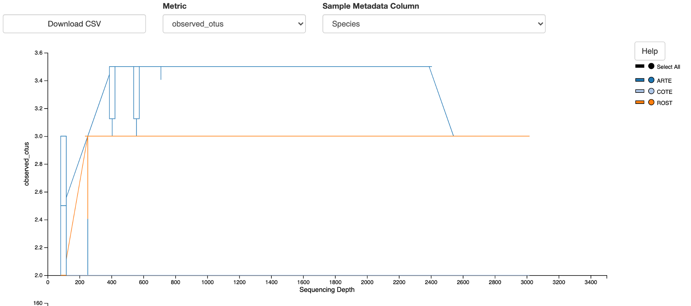

# Tern_pilot_study

This is an outline of the steps I'm taking to finish the analyses for this first paper. All the files are still in my Dropbox folder (as opposed to GitHub) and I'm running the code in the terminal.

## Useful links

[Qiime documentation](https://docs.qiime2.org/2020.2/)  
[Qiime forum](https://forum.qiime2.org/)  
[Qiime viewer](https://view.qiime2.org/)  

## 1. Extract just the terns from the full dataset (which includes puffins and tropicbirds)

**6/15/2020**

Load qiime on laptop and ```cd``` to correct directory.
```
conda activate qiime2-2019.4
cd /Users/gemmaclucas/Dropbox/Diets_from_poop/2019_terns_puffins_fecal_data_analysis/MiFish/final_taxonomy_superblast
```

Exctract the COTE, ROST, ARTE sequences from the table and rep-seqs.
```
qiime feature-table filter-samples \
  --i-table merged_table_noBirdsMammalsUnassigned.qza \
  --m-metadata-file ../mdat.txt \
  --p-where "Species='COTE' OR Species='ROST' OR Species='ARTE'" \
  --o-filtered-table Terns/Terns_merged_table_noBirdsMammalsUnassigned.qza \
  --verbose
  
qiime feature-table filter-seqs \
  --i-data merged_rep-seqs_with_repeats.qza \
  --i-table Terns/Terns_merged_table_noBirdsMammalsUnassigned.qza \
  --o-filtered-data Terns/Terns_seqs.qza
```

Create the ```.qzv``` files to go with the table and rep-seqs.
```
qiime feature-table summarize \
    --i-table Terns/Terns_merged_table_noBirdsMammalsUnassigned.qza \
    --m-sample-metadata-file ../mdat.txt \
    --o-visualization Terns/Terns_merged_table_noBirdsMammalsUnassigned
    
qiime feature-table tabulate-seqs \
    --i-data Terns/Terns_seqs.qza \
    --o-visualization Terns/Terns_seqs   
```

Make barplots to view data.
```
qiime taxa barplot\
      --i-table Terns/Terns_merged_table_noBirdsMammalsUnassigned.qza\
      --i-taxonomy superblast_taxonomy.qza\
      --m-metadata-file ../mdat.txt\
      --o-visualization  Terns/Terns_merged_table_noBirdsMammalsUnassigned-barplots.qzv
```

## 2. Calculate alpha rarefaction curves

**6/15/2020**

I need to figure out what depth to rarefy the samples to. I think it is ok to do this before fixing the taxonomy. If anything, I will just be rarefying to a higher depth than after fixing taxonomy, so this is fine.  
I need to collapse the taxonomy before I do this, so that I’m counting species and not ASVs.
```
qiime taxa collapse \
    --i-table Terns/Terns_merged_table_noBirdsMammalsUnassigned.qza \
    --i-taxonomy superblast_taxonomy.qza \
    --p-level 20 \
    --o-collapsed-table Terns/Terns_collapsed_table_noBirdsMammalsUnassigned.qza
```

Rarefy with sampling depths from 100 to 10000
```
qiime diversity alpha-rarefaction \
    --i-table Terns/Terns_collapsed_table_noBirdsMammalsUnassigned.qza \
    --m-metadata-file ../mdat.txt \
    --p-min-depth 100 \
    --p-max-depth 10000 \
    --o-visualization Terns/Terns_alpha-rarefaction-100-10000
```

For ROST and COTE it looks like the biggest change is around 1000 sequences, so redo with a finer scale:
```
qiime diversity alpha-rarefaction \
    --i-table Terns/Terns_collapsed_table_noBirdsMammalsUnassigned.qza \
    --m-metadata-file ../mdat.txt \
    --p-min-depth 100 \
    --p-max-depth 3000 \
    --p-steps 20 \
    --o-visualization Terns/Terns_alpha-rarefaction-100-3000
```
Shannon diversity is flat all the way along for ROST and COTE (not shown; ignoring ARTE as only 3 samples).    

The number of observed OTUs is 2 for COTE all the way along, but jumps up to 3 for ROST at somewhere between 200 and 400 sequences. **Use a rarefaction depth of 400 for all tern samples.** Note that this is almost the same conclusion that I came to when running this in December 2019 (then I suggested using 500, but I didn't have as fine a scale for the sampling depth).

Note that in this screenshot from the Qiime Viewer, the COTE line runs along the x-axis, so you can't really see it.




## 3. Rarefy to a sampling depth of 400

Note, this needs to be done on the original feature table, not the collapsed one. After collapsing, ```;..``` is added to any empty field in the taxonomy string (i.e. if we collapse at level 20, but level 20 is not filled, then ```;..``` is added) so then the collapsed features do not match the original taxonomy artefact.

```
qiime feature-table rarefy \
  --i-table Terns/Terns_merged_table_noBirdsMammalsUnassigned.qza \
  --p-sampling-depth 400 \
  --o-rarefied-table Terns/Terns_table_rarefied400 \
  --verbose
```

Redo the barplots for the rarefied data
```
qiime taxa barplot\
      --i-table Terns/Terns_table_rarefied400.qza\
      --i-taxonomy superblast_taxonomy.qza\
      --m-metadata-file ../mdat.txt\
      --o-visualization Terns/Terns_table_rarefied400-barplots.qzv
```

Then I exported the ```.csv``` file from Qiime Viewer using level 20 taxonomy.

Note, next time I come to run something like this, I should use the scientific names but without the full taxonomy string. I think it would make processing the data afterwards a lot easier.

## 4. Check all species assignments (range, confidence, similarity to other species)

This is a list  of the edits I need to make, then I editted the ```superblast_taxonomy.qza``` artefact using the script ```Taxonomy_edits.Rmd``` and reloaded into Qiime to do downstream analyses (code for reloading is in the script).

### Sandlances - is it possible to differentiate species?

Making a tree would help to solve this.
```
# Filter the Ammodytidae sequences and I'm including Sebastidae as an outgroup
qiime taxa filter-seqs\
     --i-sequences Terns/Terns_seqs.qza\
     --i-taxonomy superblast_taxonomy.qza\
     --p-include Ammodytidae,Sebastidae\
     --o-filtered-sequences Terns/Ammodytidae_rep-seqs

# Make the tree   
qiime phylogeny align-to-tree-mafft-fasttree \
    --i-sequences Terns/Ammodytidae_rep-seqs.qza \
    --p-n-threads 0 \
    --o-alignment Ammodytidae_alignment \
    --o-masked-alignment Ammodytidae_masked-alignment \
    --o-tree Ammodytidae_tree \
    --o-rooted-tree Ammodytidae_rooted-tree \
    --verbose
```

The tree can be viewed at https://itol.embl.de/tree/2459563435071592327228 
There are three main clades for *Ammodytes americanus* (american sand lance), *A. dubius* (northern sand lance), and *A. personatus* (Pacific sand lance). However, blasting the Pacific sandlance sequences shows:  
1. *A. marinus* (Lesser sand eel) and *A. tobianus* (Small sand eel) have since been added to the database, and these are a slightly better match. However their distributions are in the northeast Atlantic around the UK.  
2. There are also high percent ID matches with *A. hexapterus* and a lot of other *Ammodytes* species and so I think it's going to be impossible to confidently make a species assignment for the sequences classified as *A. personatus.*  
Most of the ROST sandlance sequences match *A. personatus* but it's clearly not that, so I think there is maybe just too much incomplete lineage sorting in this group to be able to make species assignments.  
**Just classify all *Ammodytes* sequences as sand lances or *Ammodytes sp*.**

### Full list of changes to make:

1. Remove taxonomy string from all entries.
2. Group all *Alosa* species to the genus level. The [tree](https://itol.embl.de/tree/2459563128991591800862#) shows that *A. aestivalis* (Blueback herring), *A. pseudoharengus* (Alewife) and *A. alosa* (Allis shad) do not form monophyletic clades for 12S, so it seems impossible to make species assignments for these.
3. Group *Clupea pallasi* (Pacific herring) into *Clupea harengus* (Atlantic herring). *C. pallasi* only comes up once in a sample with lots of *harengus* and so this may be a PCR error.
4. Change *Sardinops melanostictus* (South American pilchard) to *Clupea harengus*. It is a monotypic genus and only two reads were pulled through in a single sample after rarefying. Could this be contamination from a tropicbird sample? No, it only comes up in one COTE chick sample in the entire dataset. I guess it must be a PCR error then? That sample contains *C. harengus*, so just adding two sequences to the count for that species should have a very minimal impact on anything.
5. Change *Etheostoma parvipinne* to *Etheostomatinae* which is a subfamily within the Percidae (darters and logperches) as it's only a 95% match to the closest species on genback, but there are lots of matches to species within *Etheostomatinae.*
6. Change *Scomber japonicus* to *Scomber colias* (Atlantic chub mackerel), which is a 99 or 100% match. The range is fine, they tend to be found in warmer waters than the GoM but the range map does show that they can occur in the GoM. *Scomber scombrus* (Atlantic mackerel) has a higher occurence in the GoM but is only a 95% match. It was also a 100% match to *Scomber australasicus* but that is found in the Pacific.
7. Group all *Ammodytes* sequences to *Ammodytes sp*.


### Species that pass:

1. *Tautoga onitis* (Tautog) - range is good, 100% match, next closest species has 95% match.
2. *Tautogolabrus adspersus* (Cunner) - range is good, 99 or 100% match, next closest species has 96% match.
3. *Lophius americanus* (American angler) - range is good, 99 or 100% match, next closest species has 97% match and is only found in North Sea and UK.
4. *Gasterosteus aculeatus* (Three-spine stickleback) - range is good, 99 or 100% match, next closest species has 97% match but is from Japan.
5. *Gasterosteus wheatlandi* (Black-spotted stickleback) - range is good, 100% match, next closest species has 96% match.
6. *Pungitius pungitius* (Nine-spine stickleback) - range is good, 100% match, many other *Pungitius sp.* with over 98% match, but they are all from Europe or Asia.
7. *Ulvaria subbifurcata* (Radiated shanny) - range is good, 100% match, but it matches to many other species in the *Stichaeidae* (pricklebacks) 
    + also 100% match to *Eumesogrammus praecisus* but this is only found in the Arctic   
    + 100% match to *Askoldia variegata* but this is only found in western Pacific  
    + 100% match to *Opisthocentrus ocellatus* but this is only found in NW Pacific   
    + 99% match to *Pholidapus dybowskii* but also found in NW Pacific  
    + 99% match to *Anisarchus medius* but found in Arctic 
    + 99% match to *Xenolumpenus longipterus* but found in Japan
    + 99% match to *Poroclinus rothrocki* but this is found in the eastern Pacific  
    + 99% match to *Lumpenella longirostris* but this is found in the N Pacific  
    + 99% match to *Stichaeus punctatus punctatus* (Arctic shanny) which is a 2bp difference, compared to no dofferences with radiated shanny. Also Arctic shanny is only listed as breeding as far south as Maine, so probably not this
    + 99% match tp *Alectrias benjamini* but NW Pacific
    + 99% match to *Xiphister atropurpureus* but eastern Pacific
    + 99% match to *Alectrias alectrolophus* but NW Pacific
    + 99% match to *Opisthocentrus zonope* but NW Pacific
    + 99% match to *Xiphister mucosus* but E Pacific
    + 99% match to *Opisthocentrus zonope* but NW Pacific
    + 99% match to *Stichaeopsis nana* but NW Pacific
    + 99% match to *Zaprora silenus* but N Pacific
    + 99% match to *Cryptacanthodes giganteus* but NE Pacific
    + 99% match to *Opisthocentrus tenuis* but NW Pacific
    + 98% match to many other species **but I think a 2% divergence is going to have to be what my cut-off is for making a species level assignment**
8. *Pterois volitans* (Lionfish), 100% match, can be found in Massachusetts according to [this](https://www.seacoastonline.com/news/20170124/should-we-worry-about-lionfish-in-our-backyard#:~:text=Should%20we%20worry%20about%20lionfish%20in%20our%20backyard%20%2D%20the%20Gulf,sometime%20in%20the%20near%20future.)
    + 100% match to *Pterois lunulata* but this is Indo-pacific and this sample was on plate 1, therefore not run alongside tropicbirds at any point
9. *Sebastes fasciatus* (Acadian redfish), range is good, 99 or 100% match
    + 99% match to *Sebastes mantella* but that is not found south of Nova Scotia
    + 98/99% match to *Sebastes baramenuke* but Japan
    + 98/99% match to *Sebastes alutus* but N Pacific
    + 98/99% match to *Sebastes joyneri* but Japan
    + 98/99% match to *Sebastes cheni* but Japan
    + 98/99% match to *Sebastes viviparus* but NE Atlantic
    + 98/99% match to *Sebastes pachycephalus* but Japan
    + 98/99% match to *Sebastes aleutianus* but N Pacific
    + 98/99% match to *Sebastes rubrivinctus* but E Pacific
    + 98/99% match to *Sebastes hubbsi* but NW Pacific  
    + 98/99% match to *Sebastes ventricosus* but Japan
    + 98/99% match to *Sebastes longispinis* but Japan
    + 98/99% match to *Sebastes schlegelii* but Japan
    + 98/99% match to *Sebastes thompsoni* but Japan
    + 98/99% match to *Sebastes steindachneri* but NW Pacific
    + 98/99% match to *Sebastes taczanowskii * but NW Pacific
    + 98/99% match to *Sebastes owstoni* but NW Pacific
    + 98/99% match to *Sebastes inermis* but Japan
    + 98/99% match to *Sebastes ruberrimus* but E Pacific
    + more at 98%
10. *Menidia menidia* (Atlantic silverside), 100% match, range is good, known prey
11. *Fundulus heteroclitus* (Mummichog), 99 or 100% match, range is good, next closest match is 95%
12. *Scomber scombrus* (Atlantic mackerel), 99 or 100% match, range is good, known prey, next closest match is 95%
13. *Peprilus tricanthus* (Atlantic butterfish), 98-100% match, range is good, known prey.
    + Some sequences match equally well to *Peprilus burti* (Gulf butterfish) but the ranges do not overlap.
    + Next closest match is 95%
14. *Gadus morhua*, 100% match, range is good
    + 100% match to *Gadus ogac* (Pacific cod), found in Pacific
    + 100% match to *Gadus chalcogrammus* (Alaska pollock) AKA *Theragra chalcogramma*, found in Pacific
    + 100% match to *Gadus maccocephalus* (Pacific cod), found in Pacific
    + 99% match to *Theragra finnmarchica* (Norwegian pollock), NE Atlantic
    + 99% match to *Arctogadus glacialis* (Arctic cod), but range is much further north
    + 99% match to *Boreogadus saida* (Polar cod), but range is much further north
    + more at 98%, such as *Merlangius merlangus* (Whiting) but that is found in UK
15. *Melanogrammus aeglefinus* (Haddock) is 99-100% match, range is good
    + 99% match to *Merlangius merlangus* (Whiting) but that is found in UK
    + next closest match is 96 or 97% to *Gadus chalcogrammus* (Alaska pollock)
16. *Microgadus tomcod* (Atlantic tomcod), 99-100% match, range is good
    + 98% match to *Eleginus gracilis* (Saffron cod), but that is N Pacific and Arctic
17. *Pollachius virens* (Saithe), 100% match, range is good
    + 99% match to *Pollachius pollachius* (Pollack), but that is only found in UK waters
18. *Enchelyopus cimbrius* (Fourbeard rockling) 99-100% match, range is good, next closest match is 92%
19. *Merluccius bilinearis*, 99-100% match, range is good, next closest match is 95%
20. *Urophycis chuss*, 99-100% match, range is good, but note that the sequence on genbank is only 134 bases long
    + *Urophycis tenuis* has a complete sequence in the database, but is only a 94% match
21. *Urophycis regia*, 99-100% match, range is good, but note that the sequence on genbank is only 133 bases long
    + *Urophycis floridan* has a complete sequence in the database, but is only a 95% match and doesn't occur in GoM
22. *Urophycis tenuis* has 98-100% match, range is good, the next closest species has 91% match


## 5. Redo the barplots to check the taxonomy edits worked

```
qiime taxa barplot\
      --i-table Terns/Terns_table_rarefied400.qza\
      --i-taxonomy Terns/superblast_taxonomy_edited.qza\
      --m-metadata-file ../mdat.txt\
      --o-visualization Terns/Terns_table_rarefied400_editedTaxonomy-barplots.qzv
```
Yep, all looks good now.

What's next? Diversity analyses. Seems to be some good stuff on diversity in this tutorial - https://docs.qiime2.org/2020.8/tutorials/pd-mice/

Start there. 

